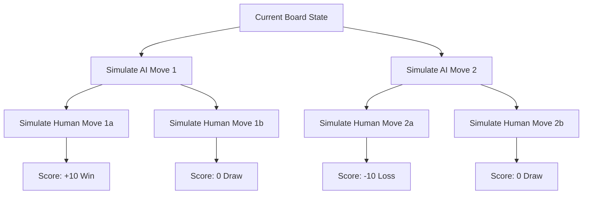

# Tic-Tac-Toe AI (Unbeatable)

An implementation of a Tic-Tac-Toe game in Python featuring an unbeatable AI opponent. The project includes both a **Command-Line Interface (CLI)** and a **Graphical User Interface (GUI)**. The AI utilizes the **Minimax Algorithm** optimized with **Alpha-Beta Pruning** to calculate the best possible moves.

---

## 📌 Project Description

This project is a terminal-based Tic-Tac-Toe game that serves as a demonstration of game theory, artificial intelligence decision-making, and tree-search algorithms. Written in Python, it follows object-oriented programming principles to separate the core game-board mechanics from the search-tree AI optimization.

Because the AI explores the entire state-space tree of Tic-Tac-Toe and plays optimally, **it is mathematically impossible to win against the AI**. The human player can only hope to achieve a draw through perfect play.

---

## 🎯 Objectives

- **Implement Game-Theory Concepts:** Apply the Minimax algorithm to a classic grid game.
- **Optimize Tree Search:** Use Alpha-Beta Pruning to reduce state evaluation iterations.
- **Adopt Clean OOP Design:** Separate concerns between the game board representation (`game.py`), AI search tree solver (`ai.py`), and CLI controller loop (`main.py`).
- **Create Premium CLI Aesthetics:** Render the game board using clean box-drawing Unicode characters and responsive color styling.

---

## ⚡ Features

- **Double Interface Support:** 
  - **GUI Mode:** Sleek Tkinter-based dark theme interface with smooth hover indicators and pop-up messages.
  - **CLI Mode:** Styled using premium box-drawing characters: `┌`, `┬`, `┐`, `┼`, `┘` and custom terminal coloring.
- **Dynamic Symbol Selection:** Select playing as **X** (goes first) or **O** (goes second) in either interface.
- **Interactive AI Thinking Delays:** Natural delay offsets (450ms) to simulate real player reasoning.
- **Robust Input & State Validation:** Prevents playing on taken cells, validates grid borders, and handles parsing.
- **Unbeatable Minimax Solver:** Evaluates all board permutations, maximizing own scores and minimizing player's outcomes.
- **Alpha-Beta Pruning Optimization:** Prunes unproductive branches in the game tree, minimizing decision-making latency.
- **Interactive Replay System:** Easily prompt to restart the game session upon completion.

---

## 🛠️ Technologies Used

- **Python 3.x**
- **Colorama** (for cross-platform terminal text coloring)
- **Math** (standard library module)
- **Time** (standard library module)

---

## 📖 Deep-Dive Documentation

### How the Minimax Algorithm Works

Minimax is a decision-making algorithm used in two-player zero-sum games. The two players are:
1. **Maximizer (AI):** Aims to get the highest possible score.
2. **Minimizer (Human):** Aims to minimize the AI's score (thus getting the lowest possible score).



At any turn, the minimax algorithm recursively simulates all possible legal moves until it reaches a terminal node (win, loss, or draw). It then propagates scores back up the game tree:
- At a Maximizer level, it chooses the maximum of the children's scores.
- At a Minimizer level, it chooses the minimum of the children's scores.

### Utility Function
We evaluate terminal states using the following utility rules:
- **AI Wins:** $+10 - \text{depth}$ (encourages the AI to choose faster wins).
- **Human Wins:** $-10 + \text{depth}$ (encourages the AI to choose moves that prolong the game if defeat is inevitable).
- **Draw:** $0$.

### Alpha-Beta Pruning Explanation

Minimax evaluates $O(b^d)$ nodes where $b$ is the branching factor and $d$ is depth. For a 3x3 Tic-Tac-Toe board, this search space is small ($9! = 362,880$ states), but for larger games, it quickly becomes intractable. 

**Alpha-Beta Pruning** optimizes search by maintaining two variables:
- $\alpha$ (Alpha): The best value that the Maximizer can guarantee at or above this level. Starts at $-\infty$.
- $\beta$ (Beta): The best value that the Minimizer can guarantee at or above this level. Starts at $+\infty$.

During recursive evaluation, if at any node we find that $\beta \le \alpha$, the opponent (minimizer) would never allow this path to be chosen. Therefore, we **prune** (discard) the remaining branches from search.

```
       Maximizer (AI)      [  Alpha = -inf, Beta = +inf  ]
                           /                           \
       Minimizer (Human) [Score: 5]                  [Score: 2] 
                         /        \                  (pruned remaining if score <= 5)
                     Child1: 5    Child2: 8
```

### Time Complexity
- **Standard Minimax:** $O(3^N)$ or worst-case $O(b^d)$, evaluating all $9!$ permutations.
- **Minimax with Alpha-Beta Pruning:** Worst case is still $O(b^d)$, but on average, it reduces search space complexity down to roughly $O(b^{d/2})$ under optimal move ordering, cutting down iterations significantly.

---

## 📥 Installation Steps

1. **Clone or download the project folder:**
   ```bash
   cd "c:\Users\THOTA NITISHA\OneDrive\Desktop\CodSoft TIC-TAC-TOE"
   ```

2. **Set up a Virtual Environment (Optional but recommended):**
   ```bash
   python -m venv venv
   # On Windows (Command Prompt)
   venv\Scripts\activate
   # On Windows (PowerShell)
   .\venv\Scripts\Activate.ps1
   ```

3. **Install Dependencies:**
   ```bash
   pip install -r requirements.txt
   ```

---

## 🚀 How to Run

### Option A: Graphical User Interface (GUI) - Recommended
Run the Tkinter GUI app:
```bash
python gui.py
```

### Option B: Command-Line Interface (CLI)
Run the terminal-based game:
```bash
python main.py
```

---

## 🎮 Sample Output

```
==============================================
         TIC-TAC-TOE UNBEATABLE AI
==============================================
Welcome to Tic-Tac-Toe! 
You will face an AI opponent using the Minimax search
algorithm optimized with Alpha-Beta Pruning.
Can you force a draw? The AI is mathematically unbeatable!

Choose your symbol (X/O): X

Game starts! You are X.
AI is O.
'X' goes first.

    1      2      3
  ┌──────┬──────┬──────┐
1 │  1,1 │  1,2 │  1,3 │
  ├──────┼──────┼──────┤
2 │  2,1 │  2,2 │  2,3 │
  ├──────┼──────┼──────┤
3 │  3,1 │  3,2 │  3,3 │
  └──────┴──────┴──────┘

👉 Your Turn (X):
Enter row and column (1-3 1-3) separated by a space (or 'q' to quit): 2 2

    1      2      3
  ┌──────┬──────┬──────┐
1 │  1,1 │  1,2 │  1,3 │
  ├──────┼──────┼──────┤
2 │  2,1 │  X   │  2,3 │
  ├──────┼──────┼──────┤
3 │  3,1 │  3,2 │  3,3 │
  └──────┴──────┴──────┘

🤖 AI is thinking (O)...
AI plays at Row 1, Col 1

    1      2      3
  ┌──────┬──────┬──────┐
1 │  O   │  1,2 │  1,3 │
  ├──────┼──────┼──────┤
2 │  2,1 │  X   │  2,3 │
  ├──────┼──────┼──────┤
3 │  3,1 │  3,2 │  3,3 │
  └──────┴──────┴──────┘

...
```

---

## 🔮 Future Enhancements

- **Dynamic Grid Sizes:** Expand the AI to work on 4x4 or 5x5 boards (using heuristic evaluation depths to manage search explosion).
- **Difficulty Settings:** Introduce random non-optimal move selections for Easy and Medium levels.
- **Online Multiplayer:** Support playing over local networks or internet web sockets.
